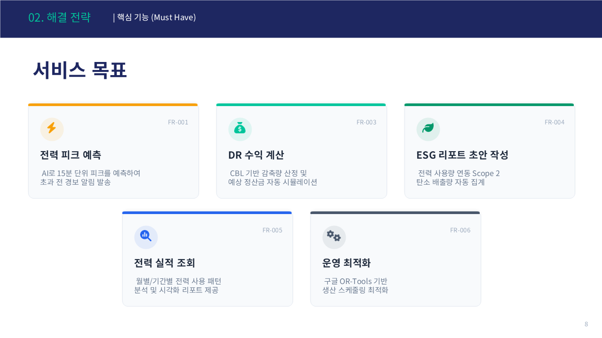
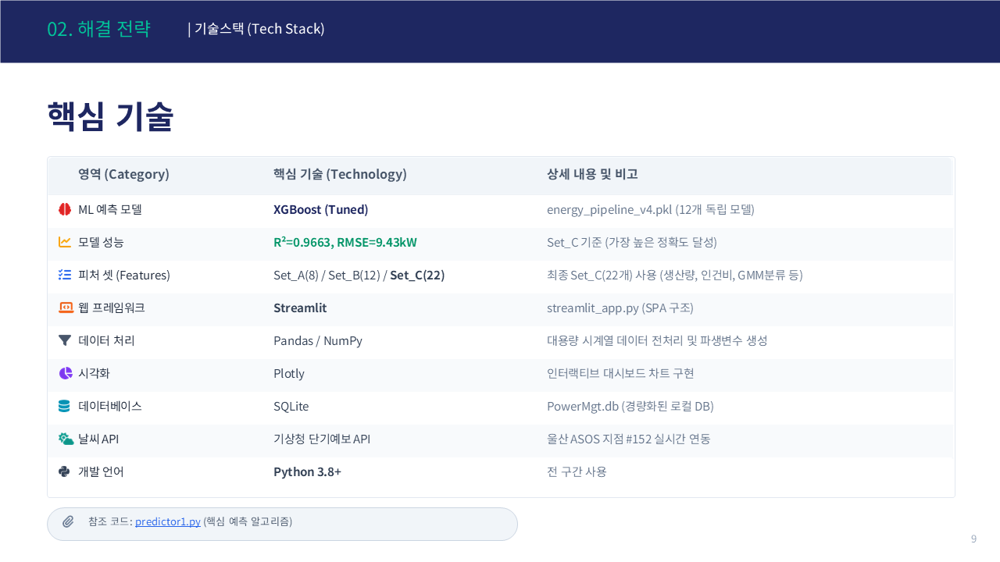
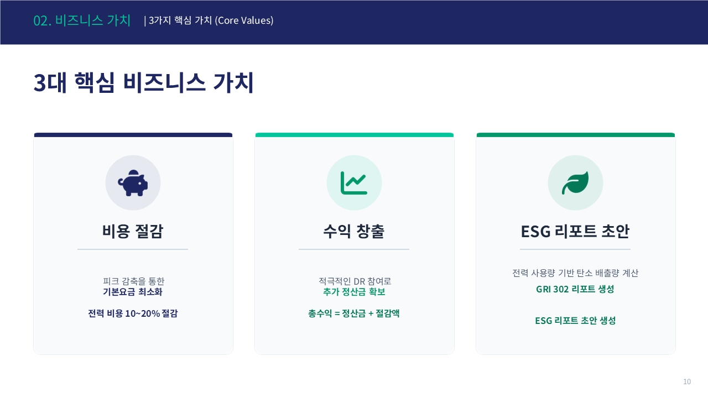
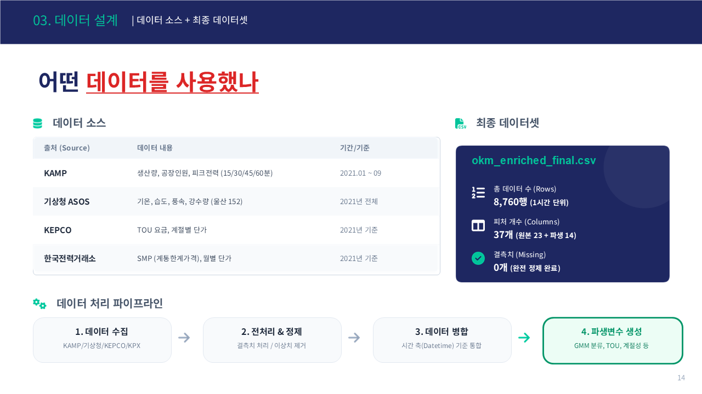
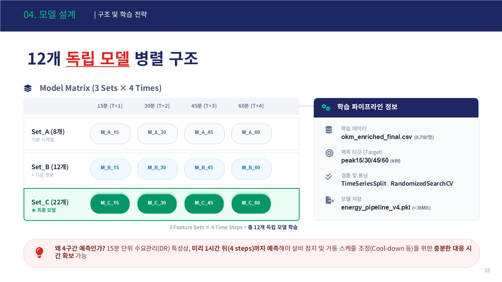

# ⚡ 공장 전력 피크 경보 & DR 수익 플랫폼

> AI 기반 제조 전력 비용 절감 및 수익 창출 플랫폼
> **올라운더팀** | 허유나 · 이형주 · 강창희 · 박순선 | 2026

---


---

## 📌 한 줄 소개

> **XGBoost 기반 15분 단위 전력 피크 예측 + DR 수익 자동 계산 플랫폼**
> 중소 제조 공장의 전기요금 절감과 수요반응(DR) 수익 창출을 동시에 지원합니다.

---

## 🔴 왜 만들었나요?


전기요금은 총 사용량이 아닌, **한 순간의 최대 피크(Peak)** 로 결정됩니다.
한 번의 피크가 **1년치 기본요금**을 결정하는 구조입니다.

---

## ✅ 무엇을 만들었나요?



| 탭 | 기능 |
|----|------|
| Tab 1 📊 | 15/30/45/60분 단위 **전력 피크 예측** + 경보 |
| Tab 2 ⚡ | 월별/기간별 **전력 실적 조회** |
| Tab 3 ⚙️ | TOU 기반 **운영 최적화** |
| Tab 4 💰 | CBL 기반 **DR 수익 시뮬레이션** |
| Tab 5 🌿 | Scope 2 자동 계산 + **GRI 302 ESG 리포트** |

---

## 🛠 기술 스택



```
ML 모델    XGBoost (R²=0.9663, RMSE=9.43kW)
프레임워크  Streamlit
DB         SQLite (PowerMgt.db)
날씨 API   기상청 단기예보 API
시각화     Plotly
```

---

## 💰 비즈니스 가치



---

## 📊 데이터



- 학습 데이터: `okm_enriched_final.csv` — **8,760행 / 37개 피처 / 결측치 0**
- 출처: KAMP + 기상청 ASOS + KEPCO + 한국전력거래소

---

## 🤖 모델




- 6개 모델 비교 실험 후 **XGBoost 최종 채택**
- **3 Sets × 4 Time Steps = 12개 독립 모델** 병렬 구조

---

## 🚀 실행 방법

```bash
pip install -r requirements.txt
streamlit run streamlit_app.py
```

---

## 📁 구조

```
├── streamlit_app.py
├── predictor1.py
├── pages/          # 5개 탭 모듈
├── dashboard/      # HTML 확정본
├── data/
├── db/
└── models/
```

---

> 본 프로젝트는 KAMP 소성가공 자원 최적화 AI 데이터셋을 활용하였습니다.
