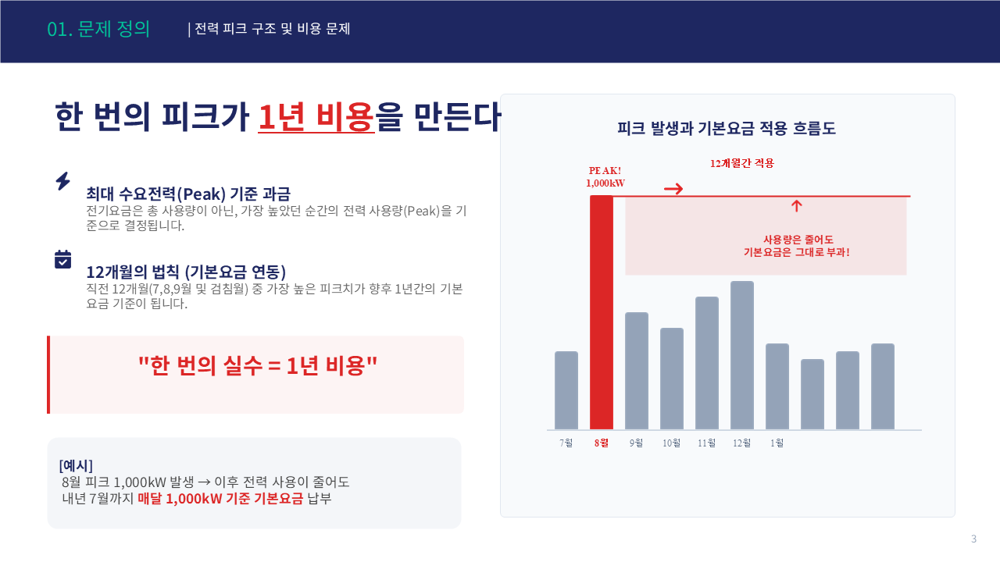

# ⚡ 공장 전력 피크 경보 & DR 수익 플랫폼

> **올라운더팀** | 허유나 · 이형주 · 강창희 · 박순선 | 2026


---

## 1. 프로젝트 개요

| 항목 | 내용 |
|------|------|
| **프로젝트명** | 공장 전력 피크 경보 & DR 수익 플랫폼 |
| **한 줄 소개** | AI 기반 15분 단위 전력 피크 예측으로 전기요금을 절감하고 수요반응(DR) 수익을 창출하는 플랫폼 |
| **데이터 출처** | KAMP 소성가공 자원 최적화 AI 데이터셋 + 기상청 ASOS + KEPCO |
| **개발 기간** | 2026년 |
| **개발 환경** | Python 3.8+, Streamlit, SQLite |

---

## 2. 문제 정의



### 2-1. 전력 피크 과금 구조

전기요금은 총 사용량이 아닌 **가장 높았던 순간의 전력 사용량(Peak)** 을 기준으로 결정됩니다.
직전 12개월(7, 8, 9월 및 검침월) 중 가장 높은 피크치가 향후 **1년간의 기본요금 기준**이 됩니다.

> 💡 **"한 번의 실수 = 1년 비용"**
> 8월에 피크 1,000kW가 발생하면, 이후 전력 사용이 줄어도 내년 7월까지 매달 1,000kW 기준으로 기본요금이 부과됩니다.

### 2-2. 현재 운영 방식의 한계 (AS-IS)

| 문제 | 현황 | 영향 |
|------|------|------|
| **수동 확인** | 전기 담당자가 계기판 하루 3~4회 수동 확인 | 실시간 대응 불가, 인력 낭비 |
| **사후 대응** | 피크 발생 후에 조치 | 이미 요금 부과된 이후 → 절감 실패 |
| **원인 불명** | 어떤 설비가 피크를 유발했는지 데이터 없음 | 원인 분석 및 예방 불가 |
| **DR 참여 불가** | 수동 관리로는 감축 이행 불확실 | DR 수익 창출 기회 상실 |

### 2-3. 타겟 페르소나

| 페르소나 | 직책 | 핵심 고충 |
|---------|------|---------|
| 김철수 (45세) | 전기 담당자 / 생산관리팀 과장 | 하루 3~4회 수동 확인, 피크 사전 예방 불가 |
| 박사장 (52세) | 공장장 / 대표이사 | 전기요금 급증 원인 파악 불가, FEMS 도입 비용 부담 |
| 이영희 (35세) | ESG 에너지 관리팀 대리 | 엑셀 수동 집계 오류, ESG 보고서 데이터 신뢰성 부족 |

---

## 3. 핵심 기능 (Must Have)

| ID | 기능 | 설명 |
|----|------|------|
| FR-001 | 전력 피크 예측 | AI로 15분 단위 피크 예측, 초과 전 경보 알림 |
| FR-003 | DR 수익 계산 | CBL 기반 감축량 산정 및 예상 정산금 자동 시뮬레이션 |
| FR-004 | ESG 리포트 | Scope 2 탄소배출량 자동 집계 및 GRI 302 리포트 생성 |
| FR-005 | 전력 실적 조회 | 월별/기간별 전력 사용 패턴 분석 및 시각화 |
| FR-006 | 운영 최적화 | OR-Tools CP-SAT 기반 생산 스케줄링 최적화 |

---

## 4. 서비스 구성

5개 탭으로 구성된 Streamlit 멀티페이지 대시보드입니다.

| 탭 | 기능명 | 주요 내용 |
|----|--------|---------|
| Tab 1 📊 | **전력 피크 예측** | Set_C 22개 피처 기반 15/30/45/60분 피크 예측, TOU 요금 자동 계산, 경보 알림 |
| Tab 2 ⚡ | **전력 실적 조회** | 연도별 전력 사용 실적 월별/기간 조회 및 시각화 |
| Tab 3 ⚙️ | **운영 최적화** | TOU 기반 비용 최소화 스케줄 도출 (OR-Tools Phase 2 예정) |
| Tab 4 💰 | **DR 시뮬레이션** | CBL 산정(최근 6일 평균) × MGP 93.41원/kWh 정산금 계산 |
| Tab 5 🌿 | **ESG 리포트** | Scope 2 자동 계산(배출계수 0.4781 kgCO₂/kWh) + GRI 302 리포트 |

---

## 5. 데이터 설계

### 5-1. 데이터 소스

| 출처 | 내용 | 기간 |
|------|------|------|
| **KAMP** | 생산량, 공장인원, 피크전력 (15/30/45/60분) | 2021.01~09 |
| **기상청 ASOS** | 기온, 습도, 풍속, 강수량 (울산 #152) | 2021년 전체 |
| **KEPCO** | TOU 요금, 계절별 단가 | 2021년 기준 |
| **한국전력거래소** | SMP (계통한계가격), 월별 단가 | 2021년 기준 |

### 5-2. 데이터 한계 및 증강 전략

KAMP 원본은 1~9월(6,120행)만 존재해 가을/겨울 데이터가 없었습니다.
이를 해결하기 위해 기상청 데이터 결합 및 GMM 클러스터링을 활용한 증강을 수행했습니다.

```
6,120행 (1~9월 실측) + 2,640행 (10~12월 증강) = 8,760행 (Full Year 완성)
```

### 5-3. 최종 데이터셋: `okm_enriched_final.csv`

| 항목 | 값 |
|------|-----|
| 총 행 수 | 8,760행 (1시간 단위) |
| 피처 수 | 37개 (원본 23 + 파생 14) |
| 결측치 | 0개 |

### 5-4. 피처 셋 구성

| Set | 피처 수 | 구성 |
|-----|--------|------|
| Set_A | 8개 | 날짜·시간·달력 기본 정보 |
| Set_B | 12개 | Set_A + 기상 데이터 (기온, 습도, 풍속, 강수량) |
| **Set_C ★** | **22개** | Set_B + 생산량, GMM생산구분, furnace_on, TOU, SMP, 인건비 |

---

## 6. 모델 설계 및 성능


### 6-1. 모델 비교 실험

총 6개 모델을 비교 실험한 결과 **XGBoost를 최종 채택**했습니다.

> furnace_on(열처리로 가동 여부)이 전체 피처 중요도의 **51.3%** 를 차지하는 이진/범주형 변수 지배 구조로, 트리 기반 모델인 XGBoost가 압도적으로 유리했습니다.

### 6-2. 12개 독립 모델 구조 (3 Sets × 4 Time Steps)

|  | T+1 (15분) | T+2 (30분) | T+3 (45분) | T+4 (60분) |
|--|-----------|-----------|-----------|-----------|
| Set_A | M_A_15 | M_A_30 | M_A_45 | M_A_60 |
| Set_B | M_B_15 | M_B_30 | M_B_45 | M_B_60 |
| **Set_C ★** | **M_C_15** | **M_C_30** | **M_C_45** | **M_C_60** |

### 6-3. 최종 성능 (Set_C 기준)

| 지표 | 값 |
|------|----|
| **R²** | **0.9663** |
| **RMSE** | **9.43 kW** |

- 하이퍼파라미터 튜닝: TimeSeriesSplit + RandomizedSearchCV 적용
- 피처 중요도 Top 3: furnace_on (51.3%) → GMM생산구분 (23.0%) → 주간여부 (8.6%)

---

## 7. 기술 스택

| 영역 | 기술 | 내용 |
|------|------|------|
| ML 예측 | XGBoost | energy_pipeline_v4.pkl (12개 독립 모델) |
| 웹 프레임워크 | Streamlit | 멀티탭 SPA 구조 |
| 데이터 처리 | Pandas / NumPy | 시계열 전처리 및 파생변수 생성 |
| 시각화 | Plotly | 인터랙티브 대시보드 |
| 데이터베이스 | SQLite | PowerMgt.db (5개 테이블) |
| 날씨 API | 기상청 단기예보 API | 울산 ASOS 지점 #152 실시간 연동 |
| 최적화 | Google OR-Tools | CP-SAT Solver (Phase 2 예정) |

---

## 8. 비즈니스 가치

| 가치 | 내용 | 기대 효과 |
|------|------|---------|
| 💰 **비용 절감** | 피크 감축을 통한 기본요금 최소화 | 전력 비용 10~20% 절감 |
| 📈 **수익 창출** | DR 참여로 추가 정산금 확보 | 총수익 = 정산금 + 절감액 |
| 🌿 **ESG 성과** | Scope 2 자동 계산 + GRI 302 리포트 생성 | ESG 보고서 업무 자동화 |

---

## 10. 프로젝트 구조

```
factory_power_peak_dr_project2/
├── streamlit_app.py              # 메인 진입점
├── predictor1.py                 # XGBoost 예측 모듈
├── power_db_operations.py        # DB + 기상청 API 연동
├── weather_api.py                # 날씨 데이터 수집
├── requirements.txt
├── pages/
│   ├── tab1_dashboard.py         # 피크 예측
│   ├── tab2_power_query.py       # 전력 조회
│   ├── tab3_dr_sim.py            # DR 시뮬레이션
│   ├── tab3_optimization.py      # 운영 최적화
│   ├── tab4_dr_sim.py            # DR 연결 wrapper
│   └── tab5_esg.py               # ESG 리포트
├── dashboard/                    # HTML 확정본 5개
├── data/                         # CSV 데이터
├── db/                           # SQLite DB
├── models/                       # XGBoost 모델
└── notebook/                     # 모델 개발 Jupyter
```

---

## 11. WBS (프로젝트 일정)


---

## 12. 팀원 소개

| 이름 | 역할 |
|------|------|
| 허유나 | 팀장 |
| 이형주 | 서기/기술보조 |
| 강창희 | 기술리더 |
| 박순선 | 스케줄관리자 |

---

> 본 프로젝트는 KAMP(제조 AI 데이터센터) 소성가공 자원 최적화 AI 데이터셋을 활용하였습니다.
