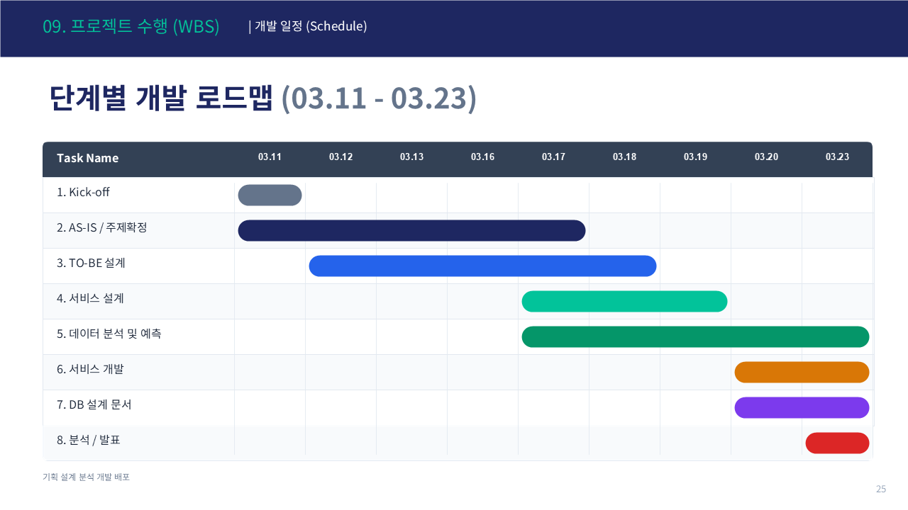
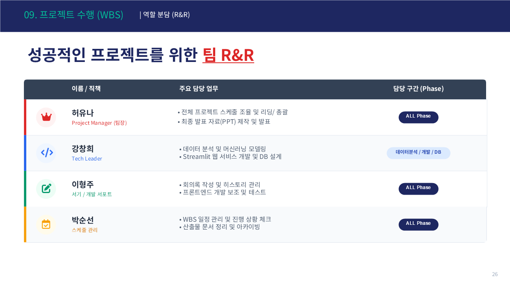
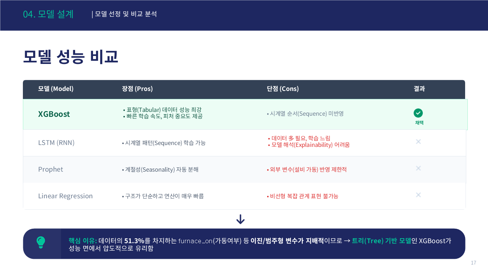

# fa08_2nd_AllRounder
- 삼정 Future Academy 최종 프로젝트 | 올라운더팀

---

# 프로젝트 기획서

## 1. 프로젝트 정의
- **목표**: 공장 전력 피크를 AI로 사전 예측하여 전기요금을 절감하고 수요반응(DR) 수익을 자동으로 계산하는 플랫폼 구축
- **주요 기능**:
  - XGBoost 기반 15분 단위 전력 피크 예측 및 경보 알림
  - CBL 기반 DR 수익 자동 시뮬레이션
  - Scope 2 탄소배출량 자동 계산 및 GRI 302 ESG 리포트 생성
  - 전력 실적 조회 및 시각화
  - OR-Tools 기반 운영 최적화 스케줄링

---

## 2. 주요 내용
- **프로젝트 기간**: 2026-03-11 ~ 2026-03-23
- **참여 인원**: 허유나, 이형주, 강창희, 박순선
- **데이터 사용처**:
  - KAMP 소성가공 자원 최적화 AI 데이터셋 (생산량, 공장인원, 피크전력)
  - 기상청 ASOS 울산 #152 (기온, 습도, 풍속, 강수량)
  - KEPCO TOU 요금 및 계절별 단가
  - 한국전력거래소 SMP (계통한계가격)

---

## 3. 일정 계획

| 작업 항목 | 시작 날짜 | 종료 날짜 | 기간(일) |
|----------|----------|----------|---------|
| 1. Kick-off | 2026-03-11 | 2026-03-11 | 1 |
| 2. AS-IS / 주제확정 | 2026-03-11 | 2026-03-17 | 7 |
| 3. TO-BE 설계 | 2026-03-12 | 2026-03-17 | 6 |
| 4. 서비스 설계 | 2026-03-17 | 2026-03-19 | 3 |
| 5. 데이터 분석 및 예측 | 2026-03-17 | 2026-03-23 | 7 |
| 6. 서비스 개발 | 2026-03-19 | 2026-03-23 | 5 |
| 7. DB 설계 문서 | 2026-03-19 | 2026-03-23 | 5 |
| 8. 분석 / 발표 | 2026-03-23 | 2026-03-24 | 2 |

---

# 작업 분할 구조 (WBS)

## 1. 단계별 작업 구성

### 1. 기획
1.1. 문제 정의 — 전력 피크 과금 구조 및 중소 공장 Pain Point 분석
1.2. 데이터 요구사항 정의 — KAMP/기상청/KEPCO/KPX 데이터 소스 확정

### 2. 데이터 수집 및 준비
2.1. 데이터 소스 조사 — KAMP 원본 (1~9월, 6,120행) + 기상청 ASOS
2.2. 데이터 수집 및 저장 — SQLite PowerMgt.db 5개 테이블 설계
2.3. 데이터 전처리 — 결측치 처리, 이상치 제거, 시간 축 기준 병합

### 3. 데이터 분석 및 모델링
3.1. 데이터 탐색 및 시각화 — EDA, 피크 패턴 분석, 상관관계 분석
3.2. 피처 엔지니어링 — GMM 클러스터링, furnace_on 역추론, 파생변수 14개 생성
3.3. 데이터 증강 — 10~12월 2,640행 생성 → 8,760행 (Full Year) 완성
3.4. 모델 선택 및 학습 — 6개 모델 비교 후 XGBoost 채택
3.5. 하이퍼파라미터 튜닝 — TimeSeriesSplit + RandomizedSearchCV
3.6. 성능 평가 — R²=0.9663, RMSE=9.43kW (Set_C 기준)

### 4. 서비스 개발
4.1. Streamlit 5탭 대시보드 개발
4.2. SQLite DB 설계 및 기상청 API 연동
4.3. DR 수익 계산 모듈 개발 (CBL 기반)
4.4. ESG GRI 302 리포트 자동 생성 모듈 개발

### 5. 결과 도출 및 보고
5.1. 결과 요약 및 비즈니스 가치 정리
5.2. 최종 발표 준비

---

# 요구사항 정의서

## 1. 기능 요구사항

| ID | 기능 | 설명 |
|----|------|------|
| FR-001 | 전력 피크 예측 | XGBoost로 15/30/45/60분 단위 피크 예측 및 경보 알림 |
| FR-003 | DR 수익 계산 | CBL 기반 감축량 산정 및 예상 정산금 자동 시뮬레이션 |
| FR-004 | ESG 리포트 | Scope 2 탄소배출량 자동 집계 및 GRI 302 리포트 생성 |
| FR-005 | 전력 실적 조회 | 월별/기간별 전력 사용 패턴 분석 및 시각화 |
| FR-006 | 운영 최적화 | OR-Tools CP-SAT 기반 생산 스케줄링 최적화 |

## 2. 비기능 요구사항
- **처리 성능**: 피크 예측 결과 3초 이내 반환
- **확장성**: Feature Set A/B/C 자동 선택으로 입력 정보 수준에 따라 유연하게 대응
- **신뢰성**: 기상청 API 장애 시 DB 내 과거 평균 데이터로 자동 대체
- **유지보수성**: MVC 아키텍처 기반 모듈화 설계로 탭별 독립 개발/수정 가능

---

# 프로젝트 설계서

## 1. 데이터 아키텍처
- **데이터 수집**: KAMP 원본 CSV + 기상청 단기예보 API (울산 ASOS #152) + KEPCO/KPX 요금 데이터
- **데이터 저장**: SQLite PowerMgt.db (Calendar / WeatherForecast / OperationResult / ElectricityTariff / OperationForecast)
- **분석 및 시각화**: Pandas/NumPy 전처리 → XGBoost 예측 → Plotly 인터랙티브 시각화

## 2. 기술 스택
- **ML 모델**: XGBoost (energy_pipeline_v4.pkl, 12개 독립 모델, R²=0.9663)
- **웹 프레임워크**: Streamlit (멀티탭 SPA 구조)
- **데이터 처리**: Pandas, NumPy, scikit-learn
- **시각화**: Plotly
- **데이터베이스**: SQLite
- **날씨 API**: 기상청 단기예보 API
- **최적화**: Google OR-Tools CP-SAT Solver
- **개발 언어**: Python 3.8+

## 3. 설계 이미지

---

# 데이터 연동 정의서

## 1. 데이터 정의
- **데이터 소스**: KAMP 소성가공 자원 최적화 AI 데이터셋 + 기상청 ASOS + KEPCO + KPX
- **최종 데이터셋**: `okm_enriched_final.csv` (8,760행 / 37개 피처 / 결측치 0)
- **주요 컬럼**:
  - `날짜`: 측정 날짜 (YYYYMMDD)
  - `hour`: 시간 (0~23)
  - `power_kw`: 전력 사용량 (kW) — 예측 타겟
  - `op_code`: 가동여부 (0/1)
  - `gmm_label`: GMM 생산구분 (0: 비가동 / 1: 고생산 / 2: 중생산 / 3: 저생산)
  - `furnace_on`: 열처리로 가동여부 (역추론 파생변수)
  - `temperature`: 기온 (°C)
  - `tou_zone`: TOU 구간 (0: 경부하 / 1: 중간부하 / 2: 최대부하)

## 2. 수집 방식
- **연동 방식**: 기상청 단기예보 API + KAMP CSV 파일 배치 수집
- **연동 주기**: 기상청 API — 1시간 단위 자동 갱신 / KAMP 데이터 — 배치 처리

---

# 시각화 리포트

## 1. 분석 결과 요약
- **피크 전력 패턴**:
  - 열처리로(furnace_on) 가동 시 피크 급증 → 피처 중요도 51.3%로 압도적 1위
  - GMM 생산구분이 전력 소비 패턴을 4단계로 명확히 구분 (중요도 23.0%)
  - 주간/야간 여부에 따른 전력 사용량 차이 유의미 (중요도 8.6%)
- **모델 성능**:
  - 6개 모델 비교 결과 XGBoost Set_C 최고 성능 달성
  - R²=0.9663, RMSE=9.43kW

## 2. 대시보드
- **Tab 1**: 날짜/시간/생산정보 입력 → 15/30/45/60분 피크 예측 + TOU 요금 자동 계산
- **Tab 2**: 연도별 전력 실적 월별/기간 조회 및 차트 시각화
- **Tab 3**: TOU 기반 비용 최소화 운영 스케줄 도출
- **Tab 4**: CBL × MGP(93.41원/kWh) DR 정산금 자동 계산
- **Tab 5**: Scope 2 자동 계산(0.4781 kgCO₂/kWh) + GRI 302 리포트 CSV 다운로드

## 3. 제안
- 피크 10% 감축 시 기본요금 연 211만원 절감 가능
- DR 참여를 통한 추가 정산금 수익 창출
- ESG GRI 302 자동 리포트로 보고서 작성 업무 자동화

---

# 프로젝트 회고

## 1. 프로젝트 개요
- **프로젝트 이름**: 공장 전력 피크 경보 & DR 수익 플랫폼
- **기간**: 2026-03-11 ~ 2026-03-23
- **팀 구성원**: 허유나, 이형주, 강창희, 박순선

---

## 2. 회고 주제

### 2.1. 잘한 점 (What went well)
- XGBoost 모델에서 R²=0.9663이라는 높은 성능 달성
- KAMP 원본(1~9월)의 데이터 부족 문제를 GMM 클러스터링 기반 증강으로 해결하여 Full Year 데이터 완성
- furnace_on(열처리로 가동여부)을 역추론 알고리즘으로 파생해 모델 성능에 크게 기여
- 예측 모델에서 끝나지 않고 DR 수익 / ESG 리포트 / 전력 조회 / 최적화까지 완성된 5탭 서비스로 구현
- MVC 아키텍처 기반 모듈화로 탭별 독립 개발 및 유지보수 가능한 구조 설계

---

### 2.2. 개선이 필요한 점 (What could be improved)
- OR-Tools CP-SAT Solver 완전 연동을 Phase 2로 미룬 점 — 현재 시뮬레이션 수준에 머무름
- 개발 과정에서 파일 버전이 여러 폴더에 분산되어 최종 정리에 시간 소요
- 탄소 배출계수 등 상수값이 파일마다 다르게 기재된 경우 발생 — 초기부터 단일 상수 파일 관리 필요

---

### 2.3. 배운 점 (Lessons learned)
- 시계열 데이터에는 TimeSeriesSplit을 적용해야 성능 과대평가를 방지할 수 있음
- "좋은 모델"보다 "좋은 피처"가 더 중요할 수 있음 — furnace_on 하나가 중요도 51.3% 차지
- ML 모델뿐 아니라 DB 설계, API 연동, UI까지 전체 시스템을 설계하고 연결하는 경험
- Scope 2, GRI 302, CBL, TOU 등 실제 에너지 산업 개념을 코드로 직접 구현하며 깊이 이해

---

### 2.4. 다음 단계 (Action items)
- OR-Tools CP-SAT Solver 완전 연동으로 진짜 최적해 계산 구현 (Phase 2)
- 기상청 API 실시간 자동 갱신 및 실제 공장 설비 데이터 연동
- Gmail API + Claude AI 이메일 파싱을 통한 DR 이벤트 자동 수신 (Phase 2)
- 초기부터 폴더 구조와 상수 관리 파일을 정해두고 시작하는 개발 습관 정립

---

## 3. 팀원별 R&R

| 이름 | 직책 | 주요 담당 업무 | 담당 구간 |
|------|------|--------------|---------|
| 허유나 | Project Manager (팀장) | 전체 프로젝트 스케줄 조율 및 리딩/총괄, 최종 발표 자료(PPT) 제작 및 발표 | ALL Phase |
| 강창희 | Tech Leader | 데이터 분석 및 머신러닝 모델링, Streamlit 웹 서비스 개발 및 DB 설계 | 데이터분석 / 개발 / DB |
| 이형주 | 서기 / 개발 서포트 | 회의록 작성 및 히스토리 관리, 프론트엔드 개발 보조 및 테스트 | ALL Phase |
| 박순선 | 스케줄 관리 | WBS 일정 관리 및 진행 상황 체크, 산출물 문서 정리 및 아카이빙 | ALL Phase |

---

## 4. 프로젝트 주요 결과 요약
- **메인대시보드 예시**:

- **성과**:
  - XGBoost 기반 전력 피크 예측 모델 개발 완료 (R²=0.9663, RMSE=9.43kW)
  - 5탭 Streamlit 대시보드 및 HTML 확정본 완성
  - SQLite PowerMgt.db 5개 테이블 설계 및 기상청 API 연동 구현
- **결과물**:
  - [GitHub 저장소](https://github.com/KpmgFuture-Academy/fa08_2nd_AllRounder): 프로젝트 산출물
